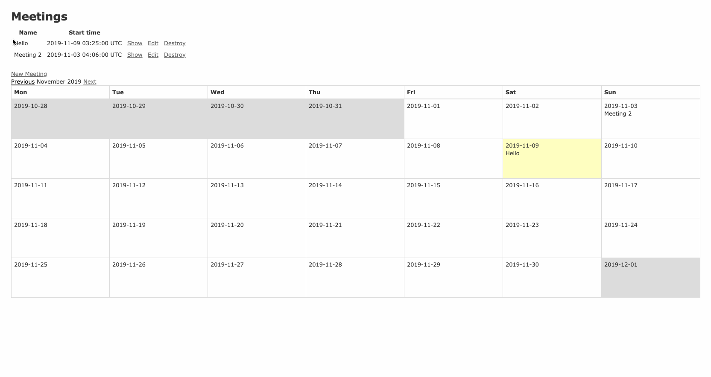

# README

This README would normally document whatever steps are necessary to get the
application up and running.

Things you may want to cover:

* Ruby version

* System dependencies

* Configuration

* Database creation

* Database initialization

* How to run the test suite

* Services (job queues, cache servers, search engines, etc.)

* Deployment instructions

* ...

## How to build a new rails app with a specific version, RSPEC, PostgreSQL(and Git).

referanal:

- <https://stackoverflow.com/questions/379141/specifying-rails-version-to-use-when-creating-a-new-application>
- <https://medium.com/@cromano31415/how-to-build-a-new-rails-app-with-rspec-postgresql-and-git-1d33c7e60456>

Step 1: Create app with specific params

```ruby
rails _6.0.0_ new app-name -T -d postgresql
```
Step 2: Install Rspec

```ruby
#in Gemfile group :development, :test add
group :development, :test do
  gem 'rspec-rails', '~> 3.8'
end
```


```ruby
# In command line
bundle install
rails generate rspec:install
```

Step 3: Set up DB

```ruby
rails db:setup
```

## How to run the project

1. run the front-end

```ruby
bin/webpack-dev-server
```

2. run the back-end

```ruby
rails s
```

visit the `localhost:3000`

## Implement `simple_calendar`

